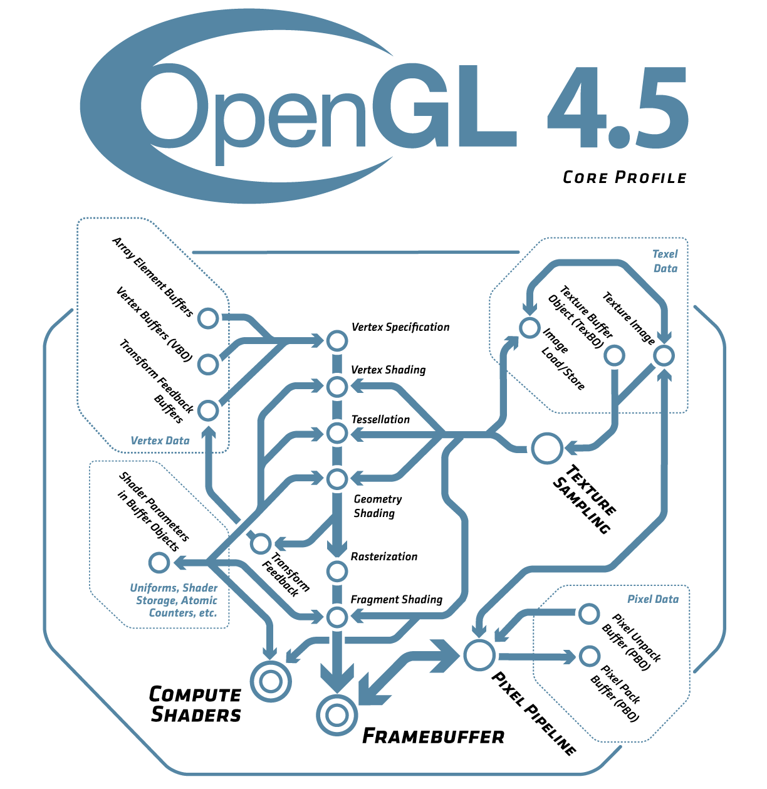

# coding

Personal coding exercises (个人代码练习)

使用`git_sync_deps.py`下载C/C++程序需要的第三方库。

`Dockerfile`文件描述构建项目的整体步骤。

```
sudo docker build -t coding-develop:0.1.0 .
```

邮箱wangrl2016@gmail.com

欢迎关注头条号 火车上遇见


## 简单数据结构和算法 ([sdsa](sdsa/))

参考geeksforgeeks.org网站编写

- [x] Array
- [x] Linked List
- [x] Stack
- [x] Queue
- [x] Binary Tree
- [x] Binary Search Tree
- [ ] Heap
- [ ] Hashing
- [ ] Graph
- [ ] Matrix
- [ ] Misc
- [ ] Advanced Data Structure
- [ ] Analysis of Algorithms
- [ ] Searching and Sorting
- [ ] Greedy Algorithms
- [ ] Dynamic Programming
- [ ] Pattern Searching
- [ ] Other String Algorithms
- [ ] Backtracking
- [ ] Divide and Conquer
- [ ] Geometric Algorithms
- [ ] Mathematical Algorithms
- [ ] Bit Algorithms
- [ ] Graph Algorithms
- [ ] Randomized Algorithms
- [ ] Branch and Bound
- [ ] Quizzes on Algorithms
- [ ] Misc

## 算法(Algorithms)第四版 ([algs4](algs4/))

参考Algorithms 4th书本编写

- [x] Basic Programming Model
- [x] Data Abstraction
- [x] Bags, Queues, and Stacks
- [x] Analysis of Algorithms
- [x] Elementary Sorts
- [x] Mergesort
- [x] Quicksort
- [ ] Priority Queues
- [ ] Symbol Tables
- [ ] Binary Search Trees
- [ ] Balanced Search Trees
- [ ] Hash Tables
- [ ] Undirected Graphs
- [ ] Directed Graphs
- [ ] Minimum Spanning Trees
- [ ] Shortest Paths
- [ ] String Sorts
- [ ] Tries
- [ ] Substring Search
- [ ] Regular Expressions
- [ ] Data Compression 


## FFmpeg示例 ([ffmpeg](ffmpeg/))

参考[FFmpeg](https://ffmpeg.org/)写的示例

* `libavcodec` encoding/decoding library

* `libavfilter` graph-based frame editing library

* `libavformat` I/O and muxing/demuxing library

* `libavdevice` special devices muxing/demuxing library

* `libavutil` common utility library

* `libswreample` audio resampling, format conversion nd mixing

* `libpostproc` post processing library

* `libswscale` color conversion and scaling library


## OpenGL示例



## OpenCV示例

* Introduction to OpenCV - build and install OpenCV on your computer

* The Core Functionality (core module) - basic building blocks of the library

* Image Processing (imgproc module) - image processing functions

* Application utils (highgui, imgcodecs, videoio modules) - application utils (GUI, image/video input/output)

## 协议

## 数字图像处理

参考Digital Image Processing教材编写

## 数学基础

## 打赏作者

1. 填写邀请码

下载今日头条极速版 填写邀请码1553058216 更多邀请码在res/文件夹


2. 微信/支付宝付款


