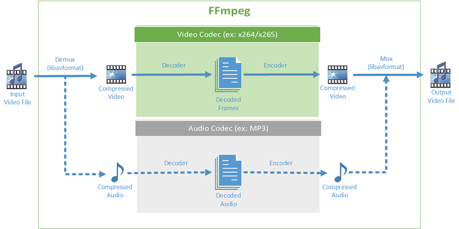

# coding

Personal coding exercises (个人代码练习)

* 使用`git_sync_deps.py`下载程序需要的第三方库。

* 每个项目下的`run.py`自动运行示例。

* 欢迎关注今日头条/西瓜视频/B站 `火车上遇见`

## 简单数据结构和算法 ([sdsa](sdsa/))

https://www.geeksforgeeks.org

https://github.com/TheAlgorithms/Java

- [x] Array
- [x] Linked List
- [x] Stack
- [x] Queue
- [x] Binary Tree
- [x] Binary Search Tree
- [x] Heap
- [x] Hashing
- [x] Graph
- [x] Matrix
- [x] Advanced Data Structure
- [x] Analysis of Algorithms
- [x] Searching and Sorting
- [x] Greedy Algorithms
- [x] Dynamic Programming
- [ ] Pattern Searching
- [x] Backtracking
- [x] Divide and Conquer
- [ ] Geometric Algorithms
- [ ] Mathematical Algorithms
- [ ] Bit Algorithms
- [ ] Graph Algorithms
- [ ] Randomized Algorithms
- [ ] Branch and Bound

## 算法(Algorithms)第四版 ([algs4](algs4/))

https://algs4.cs.princeton.edu/home/

- [x] Basic Programming Model
- [x] Data Abstraction
- [x] Bags, Queues, and Stacks
- [x] Analysis of Algorithms
- [x] Elementary Sorts
- [x] Mergesort
- [x] Quicksort
- [x] Priority Queues
- [x] Symbol Tables
- [x] Binary Search Trees
- [ ] Balanced Search Trees
- [x] Hash Tables
- [ ] Undirected Graphs
- [ ] Directed Graphs
- [ ] Minimum Spanning Trees
- [ ] Shortest Paths
- [ ] String Sorts
- [x] Tries
- [ ] Substring Search
- [ ] Regular Expressions
- [ ] Data Compression

## C++核心库 ([engine](engine/))

- [x] 智能指针
- [x] 字符串
- [ ] 排序
- [ ] 内存分配

## 设计模式 ([depa](depa/))

Design Patterns: Elements of Reusable Object-Oriented Software

https://github.com/iluwatar/java-design-patterns

- [ ] Abstract Factory
- [ ] Builder
- [ ] Prototype
- [ ] Singleton
- [ ] Adapter
- [ ] Bridge
- [ ] Composite
- [ ] Decorator
- [ ] Facade
- [ ] Flyweight
- [ ] Proxy
- [ ] Chain of Responsibility
- [ ] Command
- [ ] Iterator
- [ ] Mediator
- [ ] Memento
- [ ] Observer
- [ ] State
- [ ] Strategy
- [ ] Visitor

## FFmpeg示例 ([ffmpeg](ffmpeg/))

https://ffmpeg.org/doxygen/trunk/examples.html

- [x] `libavcodec` encoding/decoding library
- [x] `libavfilter` graph-based frame editing library
- [x] `libavformat` I/O and muxing/demuxing library
- [ ] `libavdevice` special devices muxing/demuxing library
- [x] `libavutil` common utility library
- [x] `libswreample` audio resampling, format conversion nd mixing
- [ ] `libpostproc` post processing library
- [x] `libswscale` color conversion and scaling library

- [ ] FFplay

## OpenGL示例 ([opengl](opengl/))

https://learnopengl.com/

https://www.opengl.org/

- [x] Hello Triangle
- [x] Shaders
- [x] Textures
- [x] Transformations
- [x] Coordinate Systems
- [x] Camera
- [ ] Basic Lighting
- [ ] Materials
- [ ] Lighting Maps
- [ ] Light Casters
- [ ] Multiple Lights
- [ ] Model Loading
- [ ] Depth testing
- [ ] Stencil testing
- [ ] Blending
- [ ] Face culling
- [ ] Frame Buffers
- [ ] Cube Maps
- [ ] Advanced Data
- [ ] Advanced GLSL
- [ ] Geometry Shader
- [ ] Advanced Lighting
- [ ] Gamma Correction
- [ ] Shadows
- [ ] Normal Mapping
- [ ] PBR

## Android ([android](android/))

https://developer.android.com/

https://github.com/google/oboe

- [ ] Camera
- [ ] Media Player
- [ ] Oboe

## OpenCV示例 ([opencv](opencv/))

https://docs.opencv.org/4.5.1/

- [x] Introduction to OpenCV
- [ ] Core functionality
- [ ] Image Processing
- [ ] Image file reading and writing
- [ ] Video I/O
- [ ] High-level GUI
- [ ] Video Analysis
- [ ] CameraCalibration and 3D Reconstruction
- [ ] 2D Features Framework
- [ ] Object Detection
- [ ] Deep Neural Network module
- [ ] Machine Learning
- [ ] Clustering and Search in Multi-Dimensional Spaces
- [ ] Computational Photography
- [ ] Images stitching
- [ ] Graph API
- [ ] Extra modules

## 编解码([codec](codec/))

https://www.w3.org/TR/PNG/

- [x] PPM图片格式
- [x] PCM音频格式
- [x] BMP图片格式
- [ ] JPEG图片格式解码器
- [ ] WAV音频格式
- [ ] MP3音频格式
- [ ] AAC音频格式
- [ ] H264视频格式
- [ ] MOV容器
- [ ] MP4容器

## 协议 ([specs](specs/))

存放重要的文件

- [ ] Computer Systems - A Programmer's Perspective
- [ ] C++ Concurrent in Action

## 手机群控系统 ([harun](harun/))

- [x] 自动运行
- [x] 手动运行

## 数学基础 ([math](math/))

- [ ] 线性代数
- [ ] 微积分

## 多媒体播放器 ([sfml](sfml/))

https://github.com/SFML/SFML/

- [ ] 系统
- [ ] 声音
- [ ] 图像
- [ ] 网络

## 数据格式 ([dfmt](dfmt/))

https://github.com/RazrFalcon/resvg/

https://github.com/google/skia

https://www.w3.org/TR/SVG2/

https://www.w3.org/XML/

- [ ] 编写SVG渲染引擎
- [ ] 编写JSON渲染引擎
- [ ] XML解析器
- [ ] PPT解析和生成

## 工具 ([tools](tools/))

- [x] 命令行工具
- [ ] Skia跨平台脚本

## 算法导论 ([ialgo](iaglo/))

https://mitpress.mit.edu/books/introduction-algorithms-third-edition

- [ ] The Role of Algorithms in Computing
- [ ] Getting Started
- [ ] Growth of Functions
- [ ] Divide and Conquer
- [ ] Probabilistic Analysis and Randomized Algorithms
- [ ] Heap Sort
- [ ] Quick Sort
- [ ] Sorting in Linear Time
- [ ] Medians and Order Statistics
- [ ] Elementary Data Structures
- [ ] Hash Tables
- [ ] Binary Search Trees
- [ ] Rea-Black Trees
- [ ] Augmenting Data Structures
- [ ] Dynamic Programming
- [ ] Greedy Algorithms
- [ ] Amortized Analysis
- [ ] B-Trees
- [ ] Fibonacci Heaps
- [ ] van Emde Boas Trees
- [ ] Data Structures for Disjoint Sets
- [ ] Elementary Graph Algorithms
- [ ] Minimum Spanning Trees
- [ ] Single-Source Shortest Paths
- [ ] All-Pairs Shortest Paths
- [ ] Maximum Flow
- [ ] MultiThreaded Algorithms
- [ ] Matrix Operations
- [ ] Linear Programming
- [ ] Polynomials and the FFT
- [ ] Number-Theoretic Algorithms
- [ ] String Matching
- [ ] Computational Geometry
- [ ] NP-Completeness
- [ ] Approximation Algorithms

## 打赏作者

微信/支付宝付款

