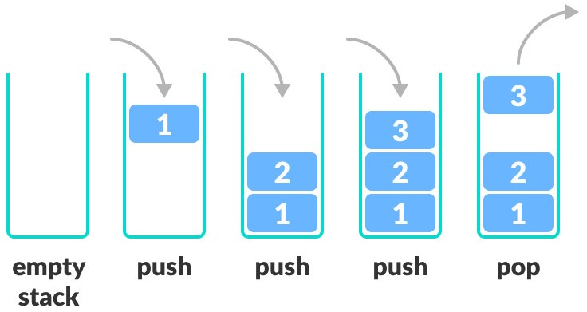

Algorithms 4th 学习

官方主页

```
https://algs4.cs.princeton.edu/home/
```

代码位置

[algs4.jar](https://algs4.cs.princeton.edu/code/algs4.jar) => Add as Library

```
https://algs4.cs.princeton.edu/code/
```

课后习题答案

```
https://github.com/reneargento/algorithms-sedgewick-wayne
```

|算法实现|算法描述|
|:-------------------|:-------------------|
|[BubbleSort](BubbleSort.java)|Bubble Sort|


### Fundamental

- [x] Stack `Stack.java` `StackArray.java`



- [x] Queue `Queue.java`


### Sorting

- [x] Selection sort `SelectionSort.java`


- [x] Insertion sort `InsertionSort.java`


- [x] Shell sort `ShellSort.java`


- [x] Merge sort `MergeSort.java`


- [x] Quick sort `QuickSort.java`


- [x] 最小堆实现的优先队列 `MinPriorityQueue.java`

- [ ] 最大堆实现的优先队列 `MaxPriorityQueue.java`

[Heap Sort](../res/heapsort-trace.png)

### Searching

### Graphs

### Strings

### Context

### Exercises

2.3.17 Sentinels `QuickWithSentinels.java`

快速排序的改进版本，将最大值放置在数组最右边防止越界。

2.3.25 Cutoff to insertion sort `QuickWithCutoff.java`

在子数组元素较少时使用插入排序。

2.4.3 Priority queue `PriorityElementary.java`

使用数组和链表实现优先队列。
