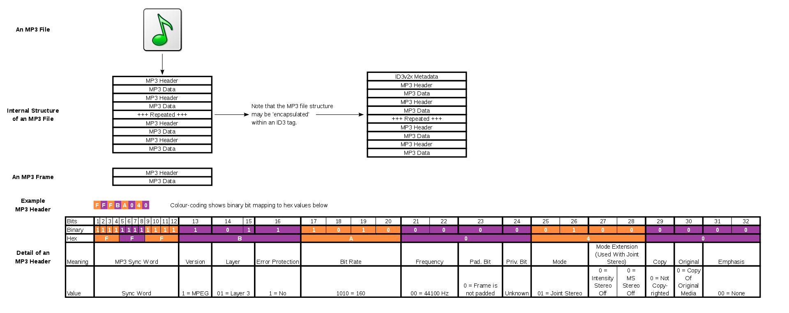

编解码

- [ ] WEP图片格式

- [ ] MOV容器

- [ ] MP4容器

- [ ] AAC音频格式

- [ ] H264视频格式

- [ ] Mp3音频格式

- [x] GIF图片格式

- [x] WAV音频格式

- [x] BMP图片格式

- [x] [PBM图片格式](https://zh.wikipedia.org/wiki/PBM格式)

- [ ] miniaudio

https://www.github.com/mackron/miniaudio

- [ ] sfml

https://github.com/SFML/SFML
